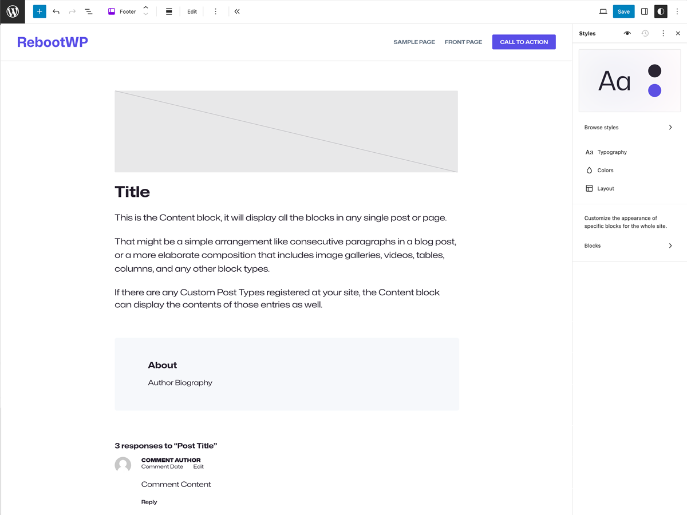

# RebootWP WordPress Block Theme  

### [Live Demo](https://www.rebootwp.com)  

**Tested up to:** 6.5  
**Requires PHP:** 7.3  
**Version:** 1.1.1  
**License:** GNU General Public License v3 or later  
**License URI:** https://www.gnu.org/licenses/gpl-2.0.html

---

### Description

Design without ever leaving your browser with the power of RebootWP & WordPress Site Editor. Customise every detail in real time — no coding required.  

RebootWP ships with thoughtfully designed Patterns, Templates & Styles that allow you to create pages and layouts quickly and easily.

---

### Changelog

**1.1.1 - 22/05/24**
- Update screenshot to match default demo

**1.1.0 - 22/05/24**
- Tweak screenshot for wp.org

**1.0.9 - 22/05/24**
- Make screenshot compatible with wp.org
- Delete index.php
- Removed default footer logo
- Update font licenses
- Add new typeface Lexend Deca and tweak current fonts
- Add image styles to core/post-featured-image
- Add box shadow to core/image
- Improve 404 template

**1.0.8 - 17/05/24**
- Update screenshot.png
- New pattern - card-contact-info.php
- Tweak purple duotone colour
- Remove unordered list style bullets

**1.0.7 - 16/05/24**
- Add underline to link hovers for better accessibility
- Rolling back the footer copyright change. Using the site-title affects meta title display and updates the site-title everywhere. Using text based that can be easily edited.

**1.0.6 - 16/05/24**
- Changed footer site-title to h6 to be more semantic
- Add text gradient option to site-title for stylistic purposes
- Change static footer copyright to site-title

**1.0.5 - 15/05/24**
- Add read more link to posts grid pattern
- Change core/read-more styling
- Make template structure more semantic
- Make content links more accessible

**1.0.4 - 15/05/24**
- Change Author Bio card to display nothing if not set

**1.0.3 - 15/05/24**
- Remove demo content from header & footer
- Update theme name in footer

**1.0.2 - 14/05/24**
- Improve Template consistency
- Add box shadow style to core/group

**1.0.1 - 14/05/24**
- Fix some typos

**1.0.0 - 14/05/24**
- Initial release

---

### Copyright
RebootWP Theme, (C) 2023 Scott Parry

RebootWP is distributed under the terms of the GNU GPL.

This program is free software: you can redistribute it and/or modify it under the terms of the GNU General Public License as published by the Free Software Foundation, either version 2 of the License, or (at your option) any later version.

This program is distributed in the hope that it will be useful, but WITHOUT ANY WARRANTY; without even the implied warranty of MERCHANTABILITY or FITNESS FOR A PARTICULAR PURPOSE. See the GNU General Public License for more details.

**Images:**  
dark-logo.webp, light-logo.webp, hero.webp, block-editor-hero.webp - created by Scott Parry.

**Fonts:**  
Inter font SIL Open Font License 1.1: https://github.com/rsms/inter/blob/master/LICENSE.txt
Lexend font SIL Open Font License 1.1: https://github.com/googlefonts/lexend?tab=OFL-1.1-1-ov-file
Mona font SIL Open Font License 1.1: https://github.com/github/mona-sans/blob/main/LICENSE  
